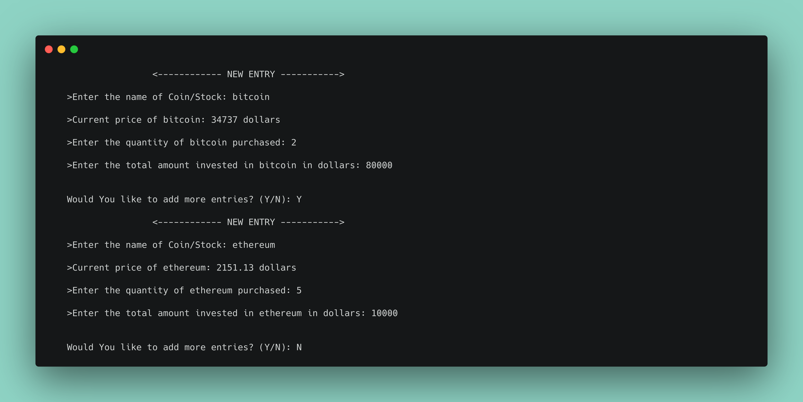
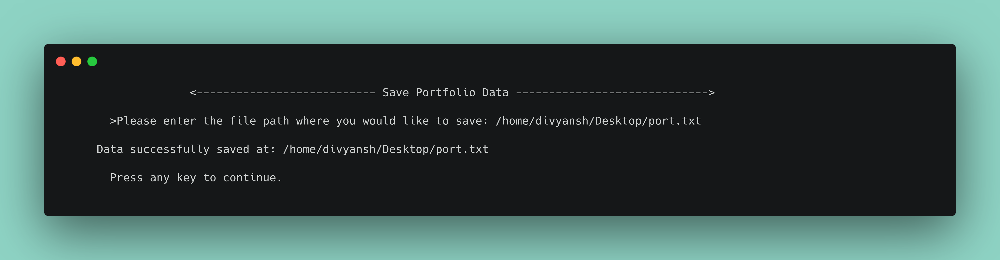
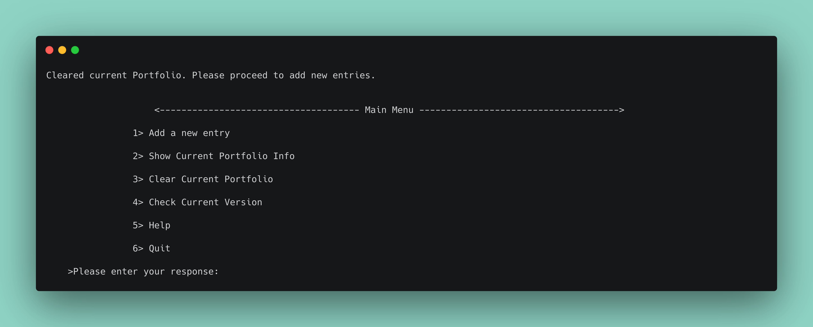

<!-- # Crypto-Portfolio-Calculator -->

# About

A Portfolio calculator for Cryptocurrencies and Stocks investments, written in C++

It takes in investment information from the user and displays a detailed analysis of their portfolio using various quantification methods.

# Features

- The entire program is menu-driven which makes it so that the user does not have to remember a lot of commands.

- It simplifies tedious calculations and shows accurate data in a user-friendly format.

- The portfolio analysis can be saved locally in a path-specified text file.

# Installing Dependencies

 It uses CMake to build the program so it needs to be installed on the system.

To know more about cmake refer to this page :- [https://cmake.org/cmake/help/latest/guide/tutorial/index.html](https://cmake.org/cmake/help/latest/guide/tutorial/index.html)

 Cmake can be installed using package managers like apt/dnf in the following ways:-

- For Ubuntu/Debian 


```cmake
sudo apt-get install cmake
```
- For fedora/CentOS
```
sudo dnf install cmake
```
# Build Instructions

- Cloning this repository
```
$ git clone https://github.com/div-sahu55/Crypto-Portfolio-Calculator.git
```
- Changing to this repository
```
$ cd Crypto-Port-Calc
```
- Generating standard build files
```
$ cmake -B build/
```
- Compiling and generating an executable 
```
$ cd build
$ make
```
# To Run
- Inside the build directory, execute:
```
$ ./port-calc
```
# Usage
- Run the program and respond with the number against the menu option to proceed.


- Enter your investment information accordingly and add as many entries as you would like to.



Check your portfolio analysis and respond with y/n whether you would like to save the file or not.


- If responded with y for saving the file, enter the file path where you'd like to save this portfolio data.



- After saving, you will be redirected to the main menu where you can see the portfolio analysis again by responding with 2 and you can clear all your entries if you respond with 3:-



# Comments

- Build instructions for Windows OS will be added soon.

- I designed this program with cryptocurrencies in mind but it can very well be used for stocks.

- Presently, I am inputting the current price of the tokens from the user. I understand how inconvenient this is and will automate this with updates in the future.

- The recommendations for any token are based on general consensus and are NOT financial advices.

- I will also be adding many more portfolio indicators like ror etc. with future updates so stay tuned :) 